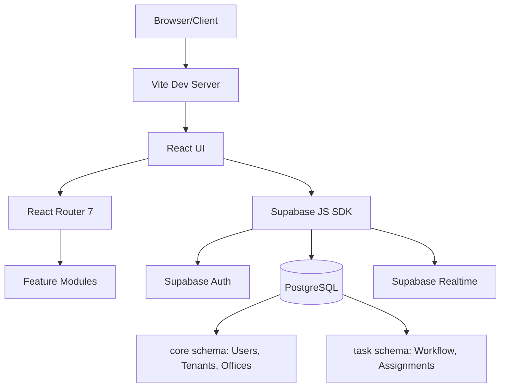

# 🏗️ GMCA UI Project Documentation

## 📋 Overview
GMCA UI is a comprehensive administrative and workflow management interface built with **React 19** and **Supabase**. It provides a robust multi-tenant platform for managing organizations, workflows, tasks, and system infrastructure.

---

## 🛠️ Tech Stack
| Category | Technology |
| :--- | :--- |
| **Frontend** | React 19, Vite, React Router 7 |
| **Backend** | Supabase (PostgreSQL, Auth, Realtime) |
| **Visualizations** | ReactFlow (Workflow Builder/Visualizer) |
| **Styling** | Vanilla CSS / Custom Inline Styles |
| **Testing** | Vitest, Playwright (E2E) |
| **Deployment** | Vercel |

---

## 🏗️ System Architecture
The project follows a **Modular Admin Hub** architecture on the frontend, integrated with a **Schema-Driven Multi-Tenant Backend**.

---

## 📂 Directory Structure
- `src/`: Core application source.
  - `pages/`: Primary application routes.
    - `AdminConsole.jsx`: Central hub for administrative features.
    - `WorkflowBuilder.jsx`: Integrated ReactFlow SOP designer.
    - `Dashboard.jsx`: Executive summary and metric visualizations.
    - `FinanceDashboard.jsx`: Specialized ledger and financial tracking.
    - `admin/`: Low-level system introspection (Schema, RLS, Triggers, RPCs).
  - `modules/`: Domain-specific business logic and sub-modules.
    - `core/`: Fundamental entities (Designations, Offices, Persons).
    - `task/`: Workflow execution and task handling logic.
    - `recruitment/`, `HR/`, `policy/`, `sop/`: Specialized vertical modules.
  - `components/`: Business UI components (NotificationBell, WorkflowHealth, etc.).
  - `services/`: API layer (Supabase singleton).
  - `shared/`: Utility functions, custom hooks, and context providers.
- `supabase/`: Backend infrastructure and configuration.
  - `migrations/`: Managed database schema changes.
  - `seed.sql`: Initial data for development and testing.
- `e2e/`: Playwright end-to-end test suites.
- `scripts/`: Development utilities (e.g., `sync-docs.js`).

---

## 🚀 Key Modules

### 1. Admin Control Tower
The administrative engine of the platform, offering:
- **Tenant Management**: End-to-end onboarding and organization configuration.
- **Infrastructure Visibility**: Real-time introspection of Database Schemas, RPC Contracts, and Triggers.
- **Security Audit**: View and verify Row Level Security (RLS) policies across all tables.
- **Meta Dashboard**: Real-time health monitoring of system processes.

### 2. Workflow Engine (SOPs)
A visual system for defining and managing Standard Operating Procedures:
- **Visual Builder**: Drag-and-drop SOP design using ReactFlow.
- **Workflow Inbox**: Centralized task queue for operational execution.
- **Bottleneck Analysis**: Heatmaps and visuals for identifying process delays.
- **Task Approval**: Multi-stage approval interface for complex workflows.

### 3. Finance & Operations
- **Finance Dashboard**: Management of financial records and ledgers.
- **Inventory/Stock**: (IssueStock) Management of physical resources.
- **Communications**: (SubmitLetter/Outbox) Integrated internal messaging and document tracking.

---

## 🛠️ Development & Deployment

### Environment Setup
1. Clone the repository.
2. Install dependencies: `npm install`
3. Configure `.env` with `VITE_SUPABASE_URL` and `VITE_SUPABASE_ANON_KEY`.
4. Start dev server: `npm run dev`

### Available Scripts
- `npm run test`: Execute Vitest unit and integration tests.
- `npm run test:e2e`: Run Playwright end-to-end tests.
- `npm run build`: Generate production bundle for Vercel.

### Promotion Pipeline
The platform includes built-in "Promote" features in the Admin Console to facilitate moving configurations between **DEV**, **STAGING**, and **PROD** environments.

---

## 🛡️ Security
- **Multi-Tenancy**: Data isolation strictly enforced via PostgreSQL RLS.
- **Authentication**: Supabase Auth with custom RBAC via JWT claims.
- **Policy Verification**: Integrated RLS viewer in the Admin Console for security audits.

---

*Generated by Antigravity (Project-Documenter) on: 2026-03-09*
